+----------------------------------+------------------------+----------+
| {width="2.4in" |                        |          |
| height="0.5881944444444445in"}   |                        |          |
|                                  |                        |          |
| SCHOOL OF INFORMATION AND        |                        |          |
| TECHNOLOGY                       |                        |          |
+----------------------------------+------------------------+----------+
| NAME: Magno, Ronnie L.           | DATE PERFORMED:        | /50      |
|                                  | 11/14/24               |          |
+----------------------------------+------------------------+----------+
| Section: IDC2                    | DATE SUBMITTED:        |          |
|                                  | 11/14/24               |          |
+----------------------------------+------------------------+----------+

# SYSADM1 -- Kerberos Lab Activity: A step-by-step Guide

**Objective:**

Set up a basic Kerberos authentication system to understand how Kerberos
manages secure logins through ticket-based access.

**Setup Requirements:**

-   Two VMs in Oracle VM, both running a Linux distribution like Ubuntu
    or CentOS.

-   VM1: Kerberos Server

-   VM2: Kerberos Client

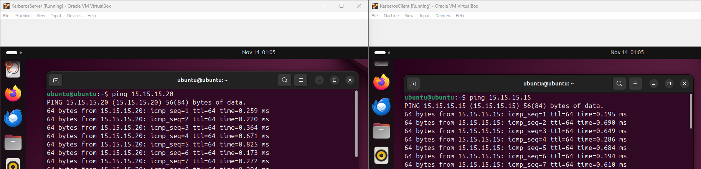{width="8.052083333333334in"
height="2.3229166666666665in"}**Step 1: Initial Setup and Package
Installation**

1.  **Update Packages on Both VMs:**

    -   Open a terminal on each VM and run:

*bash*

*sudo apt update && sudo apt upgrade --y*

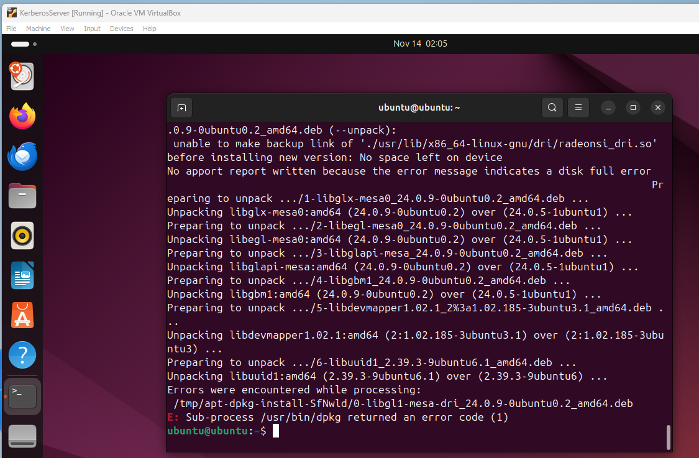{width="5.09375in"
height="3.336936789151356in"}

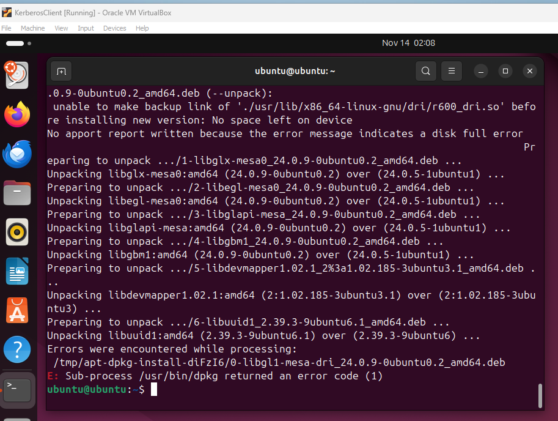{width="5.19580927384077in"
height="3.915213254593176in"}

2.  **Install Kerberos Server Packages on VM1 (Kerberos Server):**

    -   In VM1, install the Kerberos Key Distribution Center (KDC) and
        admin server:

*bash*

*sudo apt install krb5-kdc krb5-admin-server --y*

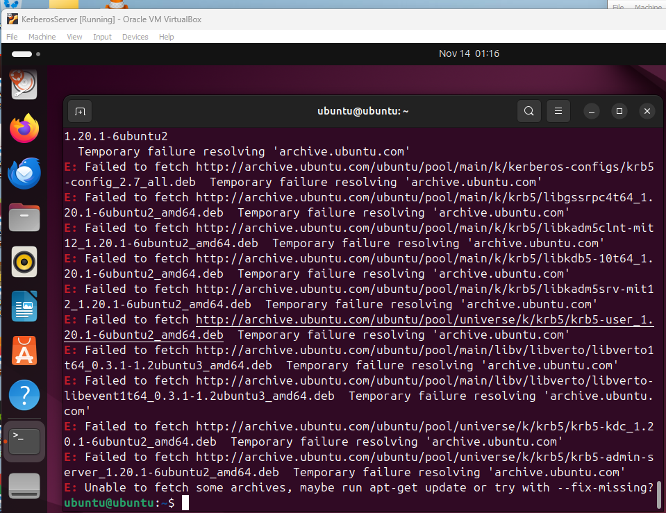{width="6.1375076552930885in"
height="4.72913823272091in"}

3.  **Install Kerberos Client Package on VM2 (Kerberos Client):**

    -   In VM2, install the Kerberos client software:

*bash*

*sudo apt install krb5-user --y*

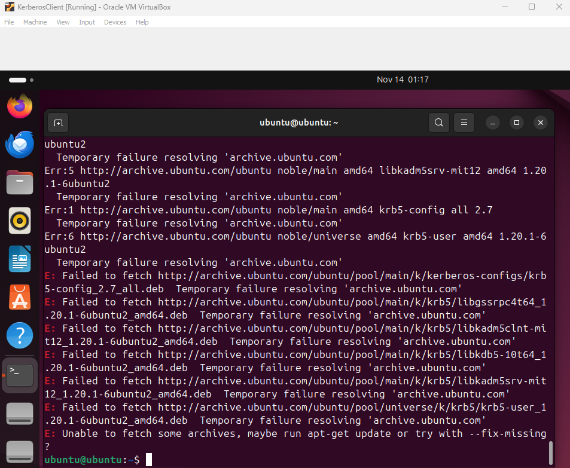{width="7.027083333333334in"
height="5.773611111111111in"}

-   During installation, when prompted, enter the Kerberos realm you
    plan to set up, e.g., MYLAB.LOCAL.

**Step 2: Configure the Kerberos Server (VM1)**

1.  **Edit the Kerberos Configuration File:**

    -   Open /etc/krb5.conf for editing:

*bash*

*sudo nano /etc/krb5.conf*

-   Set the realm as MYLAB.LOCAL. You should also specify the KDC and
    admin server as VM1's hostname or IP address:

ini

\[libdefaults\]

default_realm = MYLAB.LOCAL

\[realms\]

MYLAB.LOCAL = {

kdc = \<VM1_IP_or_hostname\>

admin_server = \<VM1_IP_or_hostname\>

}

-   Save and close the file (Ctrl+X, then Y, and Enter to confirm).

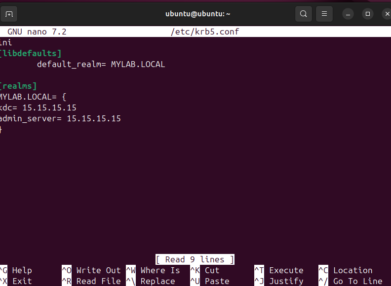{width="7.027083333333334in"
height="5.146527777777778in"}

2.  **Initialize the Kerberos Database:**

    -   Create the database for the Kerberos realm:

*bash*

*sudo krb5_newrealm*

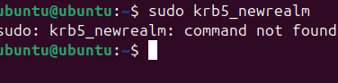{width="3.9172134733158357in"
height="0.9688856080489939in"}

-   You will be prompted to set a password for the Kerberos database.

3.  **Start and Enable the Kerberos Services:**

    -   Start the KDC and admin server, and ensure they start
        automatically on boot:

*bash*

*sudo systemctl start krb5-kdc*

*sudo systemctl start krb5-admin-server*

*sudo systemctl enable krb5-kdc*

*sudo systemctl enable krb5-admin-server*

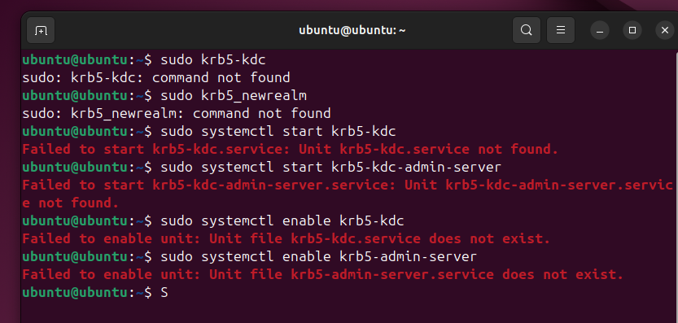{width="7.027083333333334in"
height="3.348611111111111in"}

**Step 3: Set Up a Kerberos User Principal**

1.  **Create a New User Principal:**

    -   Run the following command to create a test user in the Kerberos
        realm:

*bash*

*sudo kadmin.local -q \"addprinc testuser@MYLAB.LOCAL\"*

-   Set a password for testuser.

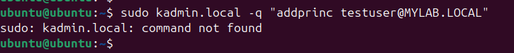{width="7.027083333333334in"
height="0.7368055555555556in"}

2.  **Verify the User Principal:**

    -   To confirm the principal is created, list all principals:

*bash*

*sudo kadmin.local -q \"listprincs\"*

{width="5.417422353455818in"
height="0.8021948818897637in"}

**Step 4: Configure the Kerberos Client (VM2)**

1.  **Edit the Kerberos Configuration File on VM2:**

    -   Open /etc/krb5.conf for editing on VM2:

*bash*

*sudo nano /etc/krb5.conf*

-   Set the default realm to MYLAB.LOCAL and point to the KDC and admin
    server on VM1. The configuration should match what you set on VM1.

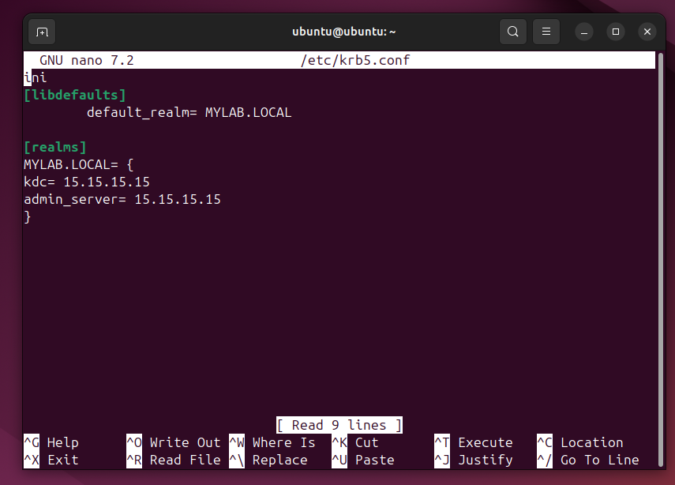{width="6.6038877952755906in"
height="4.742608267716536in"}

**Step 5: Test Kerberos Authentication**

1.  **Request a Kerberos Ticket for the User on VM2:**

    -   In the terminal on VM2, request a ticket for testuser:

*bash*

*kinit <testuser@MYLAB.LOCAL>*

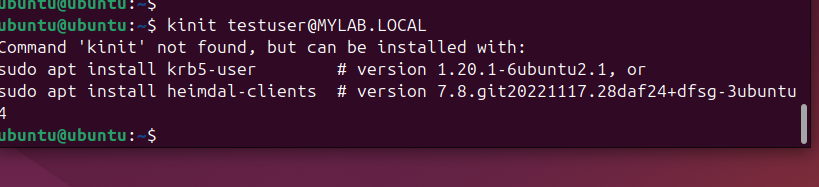{width="7.027083333333334in"
height="1.6041666666666667in"}

-   Enter the password you set for testuser.

2.  **Verify the Ticket:**

    -   Check if the ticket was issued by listing active Kerberos
        tickets:

*bash*

*klist*

-   You should see details about the ticket, such as the principal and
    expiration time, confirming successful Kerberos authentication.

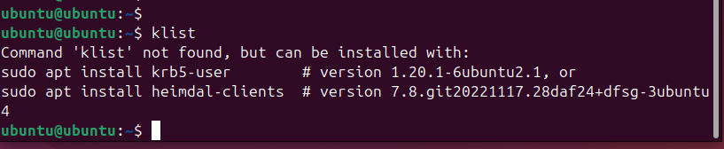{width="7.027083333333334in"
height="1.445138888888889in"}
